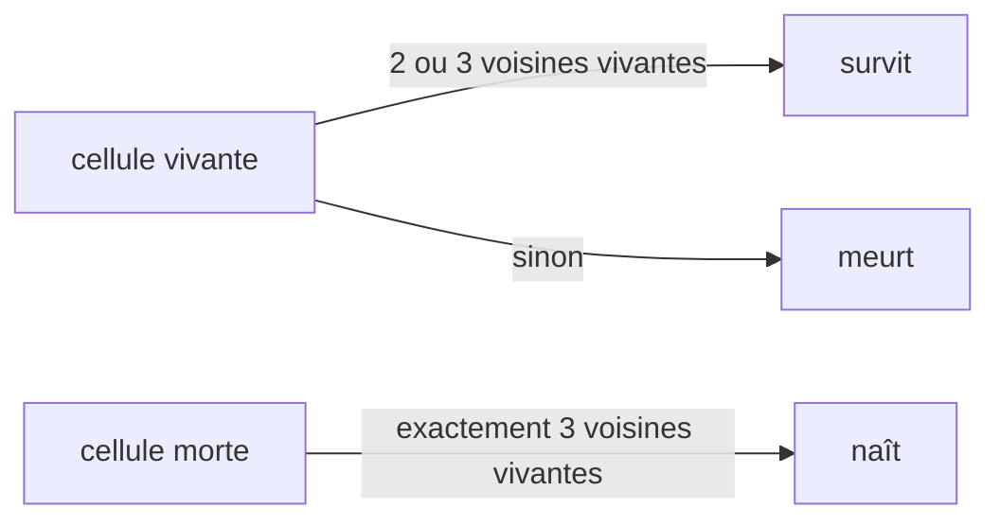

# bsq & life

 

Deux exercices algorithmiques en C pur.

## bsq — Biggest Square

Étant donné une map de cases vides et d'obstacles, trouver le plus grand carré sans obstacle et afficher la map avec le carré rempli.

```
entrée :               sortie :
....o.         xxx.o.
......         xxx...
..o...    →    xxo...
......         ......
```

Résolu avec la récurrence classique de programmation dynamique — chaque case stocke la taille du plus grand carré qui s'y termine :

```
dp[i][j] = 0                                               si obstacle
dp[i][j] = 1 + min(dp[i-1][j], dp[i][j-1], dp[i-1][j-1])   sinon
```

Une seule passe, O(lignes × colonnes). Égalités départagées en haut puis à gauche ; maps malformées rejetées avec `map error`.

## life — le Jeu de la Vie de Conway

```bash
echo 'dxss' | ./life largeur hauteur itérations
```

Deux phases :

1. **Dessin** — les commandes stdin pilotent un stylo sur le plateau : `w/a/s/d` déplacent, `x` bascule le stylo ; tant que le stylo est baissé, chaque case visitée devient vivante.
2. **Simulation** — le plateau évolue `itérations` générations, calculées dans un second buffer (la génération suivante ne lit jamais ses propres écritures) :



Plateau final affiché en `0` (vivant) et espaces (mort).

## Compilation & lancement

```bash
cc -Wall -Wextra -Werror bsq/bsq/bsq.c -o bsq && ./bsq bsq/bsq/map.txt
cc -Wall -Wextra -Werror life/main.c -o life && echo 'xdddsss' | ./life 5 5 0
```
