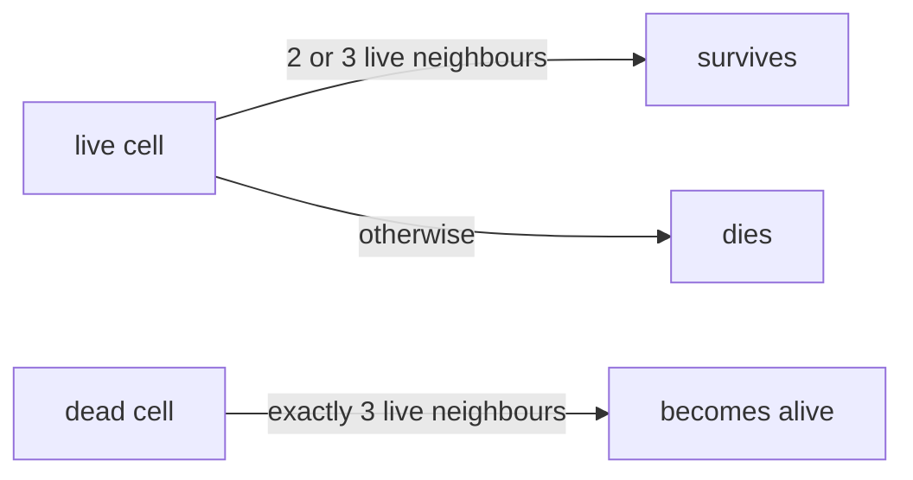

# bsq & life

 

Two algorithmic exercises in plain C.

## bsq — Biggest Square

Given a map of empty cells and obstacles, find the biggest obstacle-free square and print the map with the square filled in.

```
input:                 output:
....o.         xxx.o.
......         xxx...
..o...    →    xxo...
......         ......
```

Solved with the classic dynamic programming recurrence — each cell stores the size of the biggest square ending there:

```
dp[i][j] = 0                                               if obstacle
dp[i][j] = 1 + min(dp[i-1][j], dp[i][j-1], dp[i-1][j-1])   otherwise
```

One pass, O(rows × cols). Ties resolved top-most then left-most; malformed maps rejected with `map error`.

## life — Conway's Game of Life

```bash
echo 'dxss' | ./life width height iterations
```

Two phases:

1. **Drawing** — stdin commands drive a pen on the board: `w/a/s/d` move, `x` toggles the pen; while the pen is down, every visited cell becomes alive.
2. **Simulation** — the board evolves `iterations` generations, computed into a second buffer (the next generation never reads its own writes):



Final board printed as `0` (alive) and spaces (dead).

## Build & run

```bash
cc -Wall -Wextra -Werror bsq/bsq/bsq.c -o bsq && ./bsq bsq/bsq/map.txt
cc -Wall -Wextra -Werror life/main.c -o life && echo 'xdddsss' | ./life 5 5 0
```
